# 前言

如果网络不好请自行挂代理，比如`proxychains`，如果是`proxychains4`那么加上`-q`可以不显示`proxychains`相关的信息

---

我的工作目录是`/home/kali/Desktop/test`

首先同步最新dotnet7最新的runtime源代码`preview7`版本

```bash
git clone https://github.com/dotnet/runtime.git -b release/7.0-preview7 --depth=1
cd runtime
```

根据一系列瞎折腾，已知`coreclr`是最先需要处理的部分

文档说明在这里，注意实际脚本名变了

- https://github.com/dotnet/runtime/blob/release/7.0-preview7/docs/workflow/building/coreclr/android.md

请不要和下面的混淆了，安卓的不太一样

- https://github.com/dotnet/runtime/blob/release/7.0-preview7/docs/workflow/building/coreclr/cross-building.md

先打开`eng/common/cross/build-android-rootfs.sh`把`http://termux.net`替换为`https://mirrors.tuna.tsinghua.edu.cn/termux/apt/termux-main`

现在就可以准备安卓的rootfs，执行脚本会自动下载NDK，不需要代理，等待即可

```bash
eng/common/cross/build-android-rootfs.sh
```

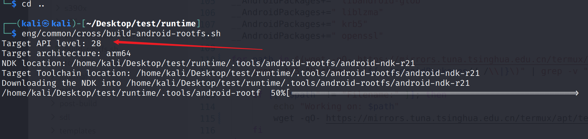

怎么看对不对呢，看下面这个文件夹就知道了

```bash
┌──(kali㉿kali)-[~/Desktop/test/runtime]
└─$ ls -al .tools/android-rootfs/android-ndk-r21/sysroot/usr/
total 32
drwxr-xr-x  8 kali kali 4096 Aug 21 11:34 .
drwxr-xr-x  3 kali kali 4096 Aug 21 11:34 ..
drwx------  2 kali kali 4096 Aug 21 11:34 bin
drwx------  3 kali kali 4096 Aug 21 11:34 etc
drwxr-xr-x 43 kali kali 4096 Aug 21 11:34 include
drwxr-xr-x 12 kali kali 4096 Aug 21 11:34 lib
drwx------  8 kali kali 4096 Aug 21 11:34 share
drwx------  3 kali kali 4096 Aug 21 11:34 var
```

如果是原始NDK的sysroot那么只有两个文件夹，相比之下脚本构建后的会多出来很多内容

```bash
┌──(kali㉿kali)-[~/Desktop/test/runtime]
└─$ ls -al /home/kali/android-ndk-r21b/sysroot/usr/
total 16
drwxr-xr-x  4 kali kali 4096 Mar 31  2020 .
drwxr-xr-x  3 kali kali 4096 Mar 31  2020 ..
drwxr-xr-x 35 kali kali 4096 Mar 31  2020 include
drwxr-xr-x  6 kali kali 4096 Mar 31  2020 lib
```

前面构建完成后输出下面的提示

```bash
Now to build coreclr, libraries and installers; run:                                                                                                                                                              
ROOTFS_DIR=$(realpath /home/kali/Desktop/test/runtime/.tools/android-rootfs/android-ndk-r21/sysroot) ./build.sh --cross --arch arm64 --subsetCategory coreclr
ROOTFS_DIR=$(realpath /home/kali/Desktop/test/runtime/.tools/android-rootfs/android-ndk-r21/sysroot) ./build.sh --cross --arch arm64 --subsetCategory libraries
ROOTFS_DIR=$(realpath /home/kali/Desktop/test/runtime/.tools/android-rootfs/android-ndk-r21/sysroot) ./build.sh --cross --arch arm64 --subsetCategory installer
```

但这个命令是不对的，文档中的命令如下

```bash
CONFIG_DIR=`realpath cross/android/arm64` ROOTFS_DIR=`realpath cross/android-rootfs/toolchain/arm64/sysroot` ./build.sh cross arm64 cmakeargs -DENABLE_LLDBPLUGIN=0
```

有一个`CONFIG_DIR`，但是搜索代码可以发现没有用到`CONFIG_DIR`，所以文档的命令也不太对

另外根据`eng/build.sh`脚本可以知道`--subsetCategory`这个传参方式已经变更为`--subset`

而支持的`--subset`选项配置在`eng/Subsets.props`

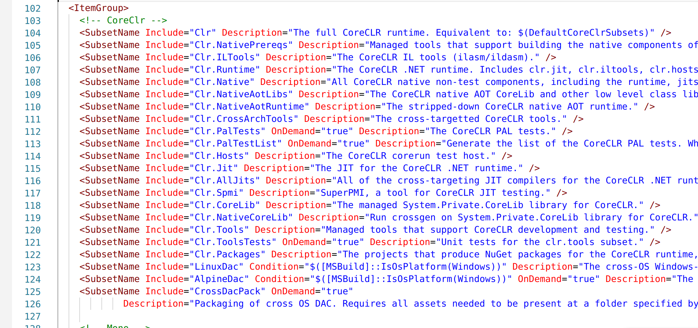

分析完成，那么先设置下面的环境变量

```bash
export TARGET_BUILD_ARCH=arm64
export ANDROID_NDK_ROOT=/home/kali/Desktop/test/runtime/.tools/android-rootfs/android-ndk-r21
export ROOTFS_DIR=/home/kali/Desktop/test/runtime/.tools/android-rootfs/android-ndk-r21/sysroot
export PATH=$ANDROID_NDK_ROOT/toolchains/llvm/prebuilt/linux-x86_64/bin:$PATH
```

然后使用下面的命令就可以开始编译了

```bash
./build.sh --cross --arch arm64 --subset Clr.NativeAotRuntime+Clr.NativeAotLibs+Libs+Mono --os Android
```

**不过等等，你可能还会遇到一些报错**，对此可以参考下面的commit对相关部分打补丁

- https://github.com/MichalStrehovsky/runtime/commit/0e1708375f93f66476179c54f8bb2123a88b901a

我们前面已经准备好Android的rootfs了。所以原作者的部分补丁就不用去掉了，所以请参考我制作的patch（改进以及添加了有关openssl的内容）

- https://github.com/xhlove/NativeAOT-AndroidExecutable/blob/master/0001-path-for-Android.patch

请注意有关Android的API Level部分我都是改成28了，当然NDK还是r21

另外patch中关于下面这样指定库查找路径的地方，请手动改为自己的rootfs路径

```bash
HINTS /home/kali/Desktop/test/runtime/.tools/android-rootfs/android-ndk-r21/sysroot/usr/lib
```

~~会出现`memfd_create`未定义的错误，可以先把下面的注释取消掉~~ 不编译clr其他的模块就不用

<!-- 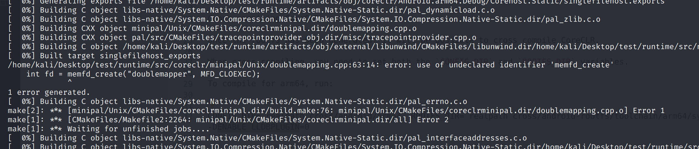 -->

<!-- 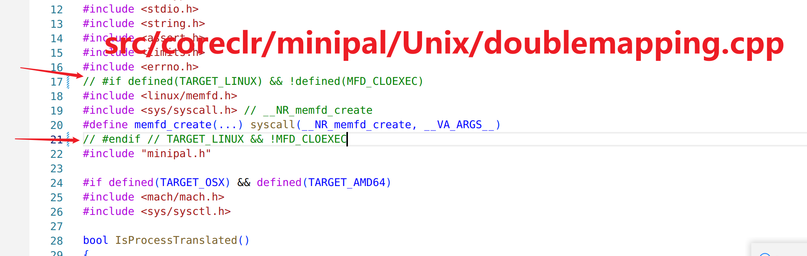 -->

如果顺利，那么会正常完成编译

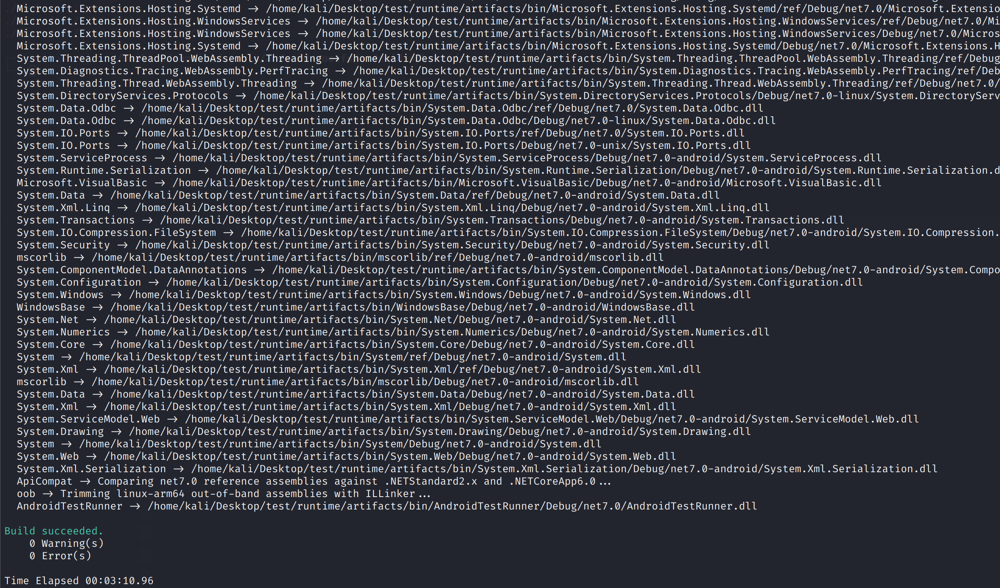

主要的几个产物目录

- `IlcSdkPath` => `artifacts/bin/coreclr/Android.arm64.Debug/aotsdk`
- `IlcFrameworkPath` => `artifacts/bin/runtime/net7.0-Android-Debug-arm64`
- `IlcFrameworkNativePath` => `artifacts/bin/runtime/net7.0-Android-Debug-arm64`


还有一个是`本地runtime`

- `artifacts/packages/Debug/Shipping`

该目录文件如下

```bash
┌──(kali㉿kali)-[~/Desktop/test/runtime]
└─$ ls -al artifacts/packages/Debug/Shipping/                                                                                                                                                                     
total 3276
drwxr-xr-x 3 kali kali    4096 Aug 21 22:31 .
drwxr-xr-x 5 kali kali    4096 Aug 21 22:31 ..
-rw-r--r-- 1 kali kali   42004 Aug 21 22:31 Microsoft.NET.Runtime.Android.Sample.Mono.7.0.0-dev.nupkg
-rw-r--r-- 1 kali kali 2317481 Aug 21 22:31 Microsoft.NET.Runtime.MonoAOTCompiler.Task.7.0.0-dev.nupkg
-rw-r--r-- 1 kali kali  947491 Aug 21 22:31 Microsoft.NET.Runtime.MonoTargets.Sdk.7.0.0-dev.nupkg
-rw-r--r-- 1 kali kali   26149 Aug 21 22:31 Microsoft.NET.Workload.Mono.ToolChain.Manifest-7.0.100.7.0.0-dev.nupkg
drwxr-xr-x 2 kali kali    4096 Aug 21 22:31 symbols
```

以编译`BBDown`为例，在clone项目后，做出以下修改

去掉`Directory.Build.props`中`ILCompiler`相关的配置

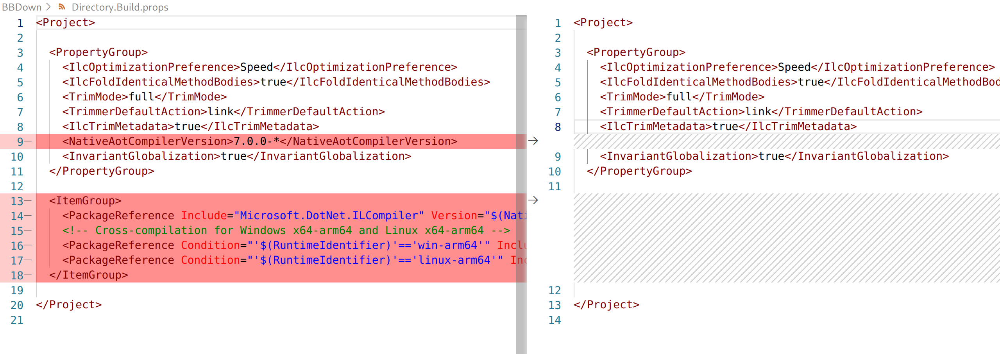

`BBDown.csproj`中添加如下配置

```xml
    <RuntimeIdentifier>android-arm64</RuntimeIdentifier>
    <PublishAot>true</PublishAot>
```

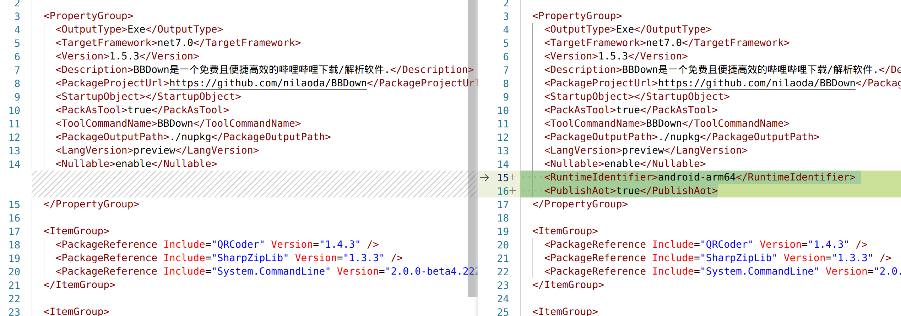

nuget.config修改如下，也就是添加本地的runtime，以及设置缓存目录，参考链接如下

- https://github.com/dotnet/runtime/blob/release/7.0-preview7/docs/workflow/using-dotnet-cli.md

```bash
<?xml version="1.0" encoding="utf-8"?>
<configuration>
  <config>
    <add key="globalPackagesFolder" value="/home/kali/Desktop/BBDown/localcache" />
  </config>
 <packageSources>
    <!--To inherit the global NuGet package sources remove the <clear/> line below -->
    <clear />
    <add key="local runtime" value="/home/kali/Desktop/test/runtime/artifacts/packages/Debug/Shipping" />
    <add key="dotnet7" value="https://pkgs.dev.azure.com/dnceng/public/_packaging/dotnet7/nuget/v3/index.json" />
    <add key="nuget.org" value="https://api.nuget.org/v3/index.json" protocolVersion="3" />
 </packageSources>
</configuration>
```

另外文档中说添加`FrameworkReference`，但实际上编译出来的只有`Microsoft.NET.Runtime.Android.Sample.Mono.7.0.0-dev.nupkg`，测试似乎没有效果

然后现在可以像下面这样编译了

```bash
export PATH=/home/kali/Desktop/tmp:$PATH
export RUNTIME_REPO=/home/kali/Desktop/test/runtime
export ROOTFS_DIR=$RUNTIME_REPO/.tools/android-rootfs
export ANDROID_NDK_ROOT=$ROOTFS_DIR/android-ndk-r21
export SYSROOT_DIR=$ANDROID_NDK_ROOT/sysroot
export PATH=$ANDROID_NDK_ROOT/toolchains/llvm/prebuilt/linux-x86_64/bin:$PATH

dotnet publish -r android-arm64 -c Release /p:SelfContained=true /p:IlcSdkPath=$RUNTIME_REPO/artifacts/bin/coreclr/Android.arm64.Debug/aotsdk/ /p:IlcFrameworkPath=$RUNTIME_REPO/artifacts/bin/runtime/net7.0-Android-Debug-arm64/ /p:IlcFrameworkNativePath=$RUNTIME_REPO/artifacts/bin/runtime/net7.0-Android-Debug-arm64/
```

我测试的时候还有指定`SysRoot`和`CppCompilerAndLinker`，但是测试发下加了`SysRoot`似乎会引发一系列问题...

```bash
/p:SysRoot=/home/kali/Desktop/test/runtime/.tools/android-rootfs/android-ndk-r21/sysroot/
```

`CppCompilerAndLinker`的设置则是参考下面这个项目，但实际上测试发现没必要，他这里hack掉几个没有生成的`.a`文件，不过前面我的patch中加上了，所以没必要

- https://github.com/josephmoresena/NativeAOT-AndroidHelloJniLib

当然在执行命令后，出现`  Generating native code`之后大概率是报错的，因为对于安卓来说有些库确实没有

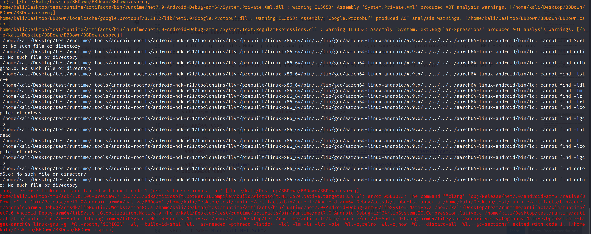

这是报错的命令，可以看到这个时候确实在生成可执行文件了，只是出错了

```bash
"clang" "obj/Release/net7.0/android-arm64/native/BBDown.o" -o "bin/Release/net7.0/android-arm64/native/BBDown" /home/kali/Desktop/test/runtime/artifacts/bin/coreclr/Android.arm64.Debug/aotsdk/libbootstrapper.a /home/kali/Desktop/test/runtime/artifacts/bin/coreclr/Android.arm64.Debug/aotsdk/libRuntime.WorkstationGC.a /home/kali/Desktop/test/runtime/artifacts/bin/runtime/net7.0-Android-Debug-arm64/libSystem.Native.a /home/kali/Desktop/test/runtime/artifacts/bin/runtime/net7.0-Android-Debug-arm64/libSystem.Globalization.Native.a /home/kali/Desktop/test/runtime/artifacts/bin/runtime/net7.0-Android-Debug-arm64/libSystem.IO.Compression.Native.a /home/kali/Desktop/test/runtime/artifacts/bin/runtime/net7.0-Android-Debug-arm64/libSystem.Net.Security.Native.a /home/kali/Desktop/test/runtime/artifacts/bin/runtime/net7.0-Android-Debug-arm64/libSystem.Security.Cryptography.Native.OpenSsl.a --target=aarch64-linux-gnu -g -Wl,-rpath,'$ORIGIN' -Wl,--build-id=sha1 -Wl,--as-needed -pthread -lstdc++ -ldl -lm -lz -lrt -pie -Wl,-z,relro -Wl,-z,now -Wl,--discard-all -Wl,--gc-sections"
```

这里有几个问题点

- `--target=aarch64-linux-gnu` 应该改为 `--target=aarch64-linux-android28`
    - 这一点可以参考 https://developer.android.com/ndk/guides/other_build_systems
    - 具体要编译成哪个APILevel可以自行决定，似乎没影响，不过最好和编译的runtime之前的设置保持一致
- `-pthread`和`-lrt`在安卓上根据网上的说法是合并到libc.so了，所以这里要去掉
- 看起来缺少libc.so，那么可以补充一个`-lc`，但实际上测试似乎没影响
- 另外实际测试还需要log库，加上`-llog`

修改后的命令如下，手动执行编译，注意这里的clang是NDK的clang，前面设置了环境变量的，另外这个命令在`BBDown/BBDown`文件夹下执行

```bash
clang "obj/Release/net7.0/android-arm64/native/BBDown.o" -o "bin/Release/net7.0/android-arm64/native/BBDown" /home/kali/Desktop/test/runtime/artifacts/bin/coreclr/Android.arm64.Debug/aotsdk/libbootstrapper.a /home/kali/Desktop/test/runtime/artifacts/bin/coreclr/Android.arm64.Debug/aotsdk/libRuntime.WorkstationGC.a /home/kali/Desktop/test/runtime/artifacts/bin/runtime/net7.0-Android-Debug-arm64/libSystem.Native.a /home/kali/Desktop/test/runtime/artifacts/bin/runtime/net7.0-Android-Debug-arm64/libSystem.Globalization.Native.a /home/kali/Desktop/test/runtime/artifacts/bin/runtime/net7.0-Android-Debug-arm64/libSystem.IO.Compression.Native.a /home/kali/Desktop/test/runtime/artifacts/bin/runtime/net7.0-Android-Debug-arm64/libSystem.Net.Security.Native.a /home/kali/Desktop/test/runtime/artifacts/bin/runtime/net7.0-Android-Debug-arm64/libSystem.Security.Cryptography.Native.OpenSsl.a --target=aarch64-linux-android28 -g -Wl,--build-id=sha1 -Wl,--as-needed -lstdc++ -ldl -lm -lz -lc -llog -pie -Wl,-z,relro -Wl,-z,now -Wl,--discard-all -Wl,--gc-sections
```

耐心等待，然后正常情况下就会生成BBDown可执行文件

其实到了生成文件这一步，这里的命令可以自己指定参数手动生成了

根据分析，也可以自己修改`src/coreclr/nativeaot/BuildIntegration/Microsoft.NETCore.Native.Unix.targets`，然后能够自动生成正确的编译命令

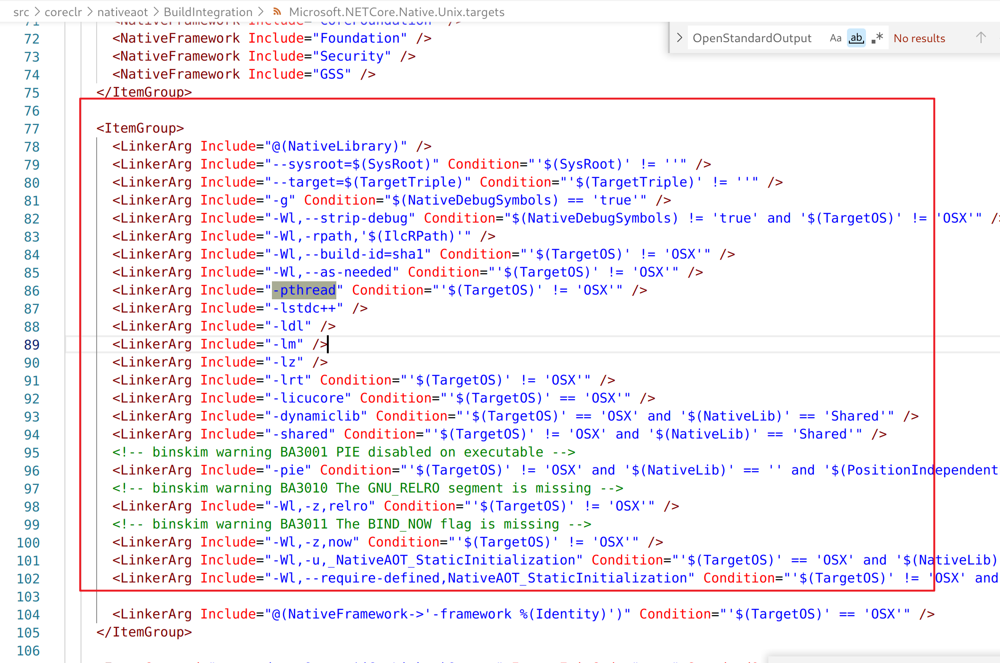

---

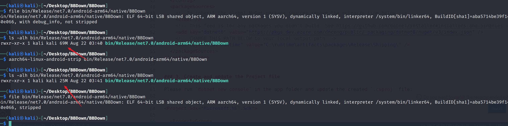

文件很大，用`aarch64-linux-android-strip`去除符号信息可以大幅减少大小

```bash
aarch64-linux-android-strip bin/Release/net7.0/android-arm64/native/BBDown
```

推送到手机，添加执行权限，然后执行，会提示找不到`libc++_shared.so`

```bash
flame:/data/local/tmp # ./BBDown
CANNOT LINK EXECUTABLE "./BBDown": library "libc++_shared.so" not found: needed by main executable
```

把NDK的`libc++_shared.so`推送到同一个目录即可，so在`NDK`目录下的这个位置

- toolchains/llvm/prebuilt/linux-x86_64/sysroot/usr/lib/aarch64-linux-android/libc++_shared.so

然后指定`LD_LIBRARY_PATH`执行`BBDown`

```bash
LD_LIBRARY_PATH=/data/local/tmp /data/local/tmp/BBDown
```

但是会出现下面的错误，这是因为C#部分API在安卓上并没有完成实现，但实际上是可以运行的

补充一点，如果是shell用户执行程序，那么没有这么详细的异常堆栈，必须是root用户才行

```log
08-22 15:47:37.458 28035 28035 E DOTNET  : Unhandled Exception: 
08-22 15:47:37.458 28035 28035 E DOTNET  : System.PlatformNotSupportedException: Operation is not supported on this platform.
08-22 15:47:37.458 28035 28035 E DOTNET  :    at System.ConsolePal.set_BackgroundColor(ConsoleColor) + 0x28
08-22 15:47:37.458 28035 28035 E DOTNET  :    at BBDown.Program.<Main>d__54.MoveNext() + 0x708
08-22 15:47:37.458 28035 28035 E DOTNET  : --- End of stack trace from previous location ---
08-22 15:47:37.458 28035 28035 E DOTNET  :    at System.Runtime.ExceptionServices.ExceptionDispatchInfo.Throw() + 0x28
08-22 15:47:37.458 28035 28035 E DOTNET  :    at System.Runtime.CompilerServices.TaskAwaiter.ThrowForNonSuccess(Task) + 0xf8
08-22 15:47:37.458 28035 28035 E DOTNET  :    at System.Runtime.CompilerServices.TaskAwaiter.HandleNonSuccessAndDebuggerNotification(Task) + 0x74
08-22 15:47:37.458 28035 28035 E DOTNET  :    at System.Runtime.CompilerServices.TaskAwaiter.ValidateEnd(Task) + 0x28
08-22 15:47:37.458 28035 28035 E DOTNET  :    at BBDown.Program.<Main>(String[]) + 0x20
08-22 15:47:37.458 28035 28035 E DOTNET  :    at BBDown!<BaseAddress>+0xdd94f8
08-22 15:47:37.458 28035 28035 E DOTNET  : 
08-22 15:47:37.458 28035 28035 F libc    : Fatal signal 6 (SIGABRT), code -1 (SI_QUEUE) in tid 28035 (BBDown), pid 28035 (BBDown)
08-22 15:47:37.467 28039 28039 I crash_dump64: obtaining output fd from tombstoned, type: kDebuggerdTombstone
08-22 15:47:37.468   975   975 I tombstoned: received crash request for pid 28035
08-22 15:47:37.469 28039 28039 I crash_dump64: performing dump of process 28035 (target tid = 28035)
08-22 15:47:37.469 28039 28039 F DEBUG   : *** *** *** *** *** *** *** *** *** *** *** *** *** *** *** ***
08-22 15:47:37.469 28039 28039 F DEBUG   : Build fingerprint: 'google/flame/flame:11/RQ3A.210805.001.A1/7474174:user/release-keys'
08-22 15:47:37.469 28039 28039 F DEBUG   : Revision: 'MP1.0'
08-22 15:47:37.469 28039 28039 F DEBUG   : ABI: 'arm64'
08-22 15:47:37.470 28039 28039 F DEBUG   : Timestamp: 2022-08-22 15:47:37+0800
08-22 15:47:37.470 28039 28039 F DEBUG   : pid: 28035, tid: 28035, name: BBDown  >>> ./BBDown <<<
08-22 15:47:37.470 28039 28039 F DEBUG   : uid: 0
08-22 15:47:37.470 28039 28039 F DEBUG   : signal 6 (SIGABRT), code -1 (SI_QUEUE), fault addr --------
08-22 15:47:37.470 28039 28039 F DEBUG   :     x0  0000000000000000  x1  0000000000006d83  x2  0000000000000006  x3  0000007fe9effc20
08-22 15:47:37.470 28039 28039 F DEBUG   :     x4  fefefefefefefeff  x5  fefefefefefefeff  x6  fefefefefefefeff  x7  7f7f7f7f7f7f7f7f
08-22 15:47:37.470 28039 28039 F DEBUG   :     x8  00000000000000f0  x9  97a20f615b36ace6  x10 0000000000000000  x11 ffffffc0ffffffdf
08-22 15:47:37.470 28039 28039 F DEBUG   :     x12 0000000000000001  x13 0000000000000002  x14 001b15188ef2db40  x15 0000000000139a38
08-22 15:47:37.470 28039 28039 F DEBUG   :     x16 000000777c81ac80  x17 000000777c7fc870  x18 000000777d894000  x19 0000000000006d83
08-22 15:47:37.470 28039 28039 F DEBUG   :     x20 0000000000006d83  x21 00000000ffffffff  x22 0000007fe9effdb0  x23 0000005c651eef78
08-22 15:47:37.470 28039 28039 F DEBUG   :     x24 0000005c6523c240  x25 0000005c64b014f8  x26 0000000000000000  x27 0000000000000000
08-22 15:47:37.470 28039 28039 F DEBUG   :     x28 0000000000000000  x29 0000007fe9effca0
08-22 15:47:37.470 28039 28039 F DEBUG   :     lr  000000777c7b02a0  sp  0000007fe9effc00  pc  000000777c7b02cc  pst 0000000000000000
08-22 15:47:37.470 28039 28039 F DEBUG   : backtrace:
08-22 15:47:37.470 28039 28039 F DEBUG   :       #00 pc 000000000004e2cc  /apex/com.android.runtime/lib64/bionic/libc.so (abort+164) (BuildId: 49090ae59e6ae37f8beae53c551820ad)
08-22 15:47:37.470 28039 28039 F DEBUG   :       #01 pc 00000000006435cc  /data/local/tmp/BBDown (BuildId: aba5714be39f14936ce5a7e470b04df65550e066)
08-22 15:47:37.470 28039 28039 F DEBUG   :       #02 pc 00000000009b41e4  /data/local/tmp/BBDown (BuildId: aba5714be39f14936ce5a7e470b04df65550e066)
08-22 15:47:37.470 28039 28039 F DEBUG   :       #03 pc 00000000009b40e8  /data/local/tmp/BBDown (BuildId: aba5714be39f14936ce5a7e470b04df65550e066)
08-22 15:47:37.470 28039 28039 F DEBUG   :       #04 pc 0000000000a8d894  /data/local/tmp/BBDown (BuildId: aba5714be39f14936ce5a7e470b04df65550e066)
08-22 15:47:37.470 28039 28039 F DEBUG   :       #05 pc 0000000000a8def4  /data/local/tmp/BBDown (BuildId: aba5714be39f14936ce5a7e470b04df65550e066)
08-22 15:47:37.470 28039 28039 F DEBUG   :       #06 pc 0000000000a8dce0  /data/local/tmp/BBDown (BuildId: aba5714be39f14936ce5a7e470b04df65550e066)
08-22 15:47:37.470 28039 28039 F DEBUG   :       #07 pc 000000000062e1a4  /data/local/tmp/BBDown (BuildId: aba5714be39f14936ce5a7e470b04df65550e066)
08-22 15:47:37.470 28039 28039 F DEBUG   :       #08 pc 0000000000a91ad4  /data/local/tmp/BBDown (BuildId: aba5714be39f14936ce5a7e470b04df65550e066)
08-22 15:47:37.470 28039 28039 F DEBUG   :       #09 pc 0000000000a94434  /data/local/tmp/BBDown (BuildId: aba5714be39f14936ce5a7e470b04df65550e066)
08-22 15:47:37.470 28039 28039 F DEBUG   :       #10 pc 0000000000a94330  /data/local/tmp/BBDown (BuildId: aba5714be39f14936ce5a7e470b04df65550e066)
08-22 15:47:37.470 28039 28039 F DEBUG   :       #11 pc 0000000000a942b4  /data/local/tmp/BBDown (BuildId: aba5714be39f14936ce5a7e470b04df65550e066)
08-22 15:47:37.470 28039 28039 F DEBUG   :       #12 pc 0000000000839ffc  /data/local/tmp/BBDown (BuildId: aba5714be39f14936ce5a7e470b04df65550e066)
08-22 15:47:37.470 28039 28039 F DEBUG   :       #13 pc 0000000000dd94f4  /data/local/tmp/BBDown (BuildId: aba5714be39f14936ce5a7e470b04df65550e066)
08-22 15:47:37.470 28039 28039 F DEBUG   :       #14 pc 000000000058f4d4  /data/local/tmp/BBDown (BuildId: aba5714be39f14936ce5a7e470b04df65550e066)
08-22 15:47:37.470 28039 28039 F DEBUG   :       #15 pc 000000000004988c  /apex/com.android.runtime/lib64/bionic/libc.so (__libc_init+108) (BuildId: 49090ae59e6ae37f8beae53c551820ad)
08-22 15:47:37.475  1562  2009 W NativeCrashListener: Couldn't find ProcessRecord for pid 28035
08-22 15:47:37.475 28039 28039 E crash_dump64: AM data write failed: Broken pipe
08-22 15:47:37.478   975   975 E tombstoned: Tombstone written to: /data/tombstones/tombstone_04
```

在我手动patch掉有关Console控制颜色相关的函数后，可以看到能够执行输出，只不过输出是在logcat

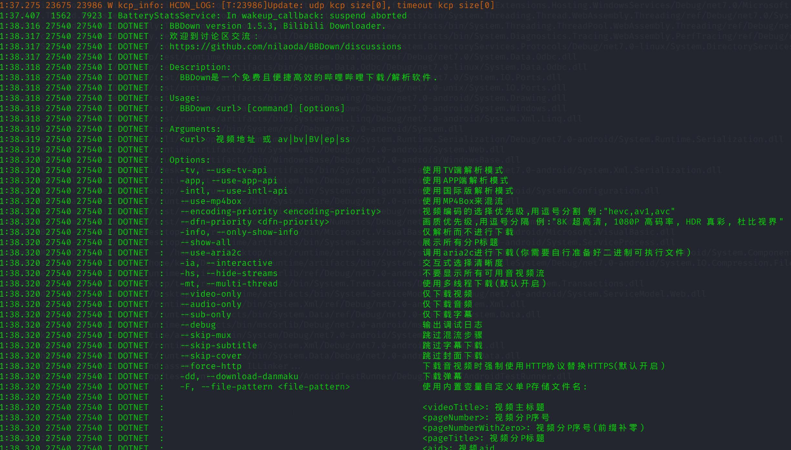

尝试下载视频，不过还是没成功，看起来是有一些编译问题，或者是runtime在安卓上实现不全导致？

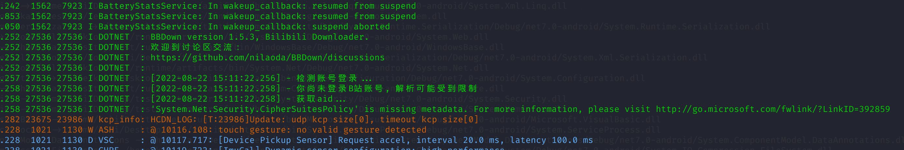

# 总结

C#程序编译为安卓的库或者可执行程序是完全可行的，只是目前还存在部分问题

希望后续会有更多改进优化，早日完整支持

# 参考

- https://github.com/josephmoresena/NativeAOT-AndroidHelloJniLib
- https://github.com/MichalStrehovsky/runtime/commit/0e1708375f93f66476179c54f8bb2123a88b901a
- https://github.com/dotnet/runtime/blob/release/7.0-preview7